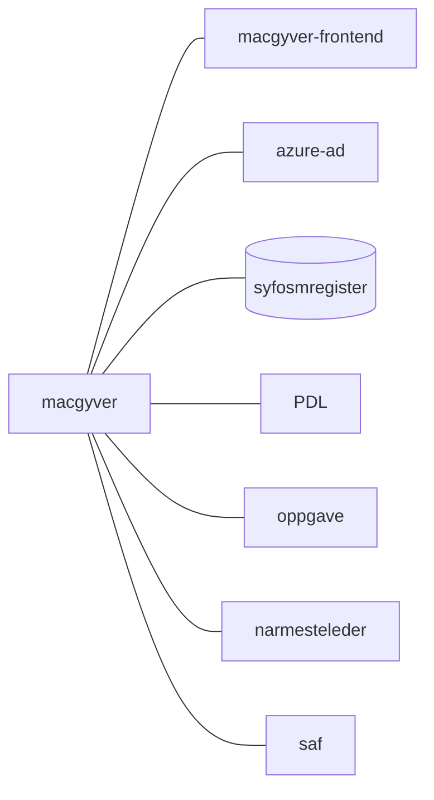

[](https://github.com/navikt/macgyver/actions/workflows/deploy.yml)

# macgyver
Application that fixes stuff like Macgyver for team sykmelding
frontend application is located here [README.md](web/README.md)

## Technologies used

* Kotlin
* Ktor
* Gradle
* Junit

#### Requirements

* JDK 21

## FlowChart
This the high level flow of the application



## Getting started

#### Build and run tests

To build locally and run the integration tests you can simply run
``` bash
./gradlew shadowJar
```
or on windows
`gradlew.bat shadowJar`

Creating a docker image should be as simple as
``` shell
docker build -t macgyver .
```

#### :floppy_disk: Running a docker image

``` shell
docker run --rm -it -p 8080:8080 macgyver
```

### Upgrading the gradle wrapper

Find the newest version of gradle here: https://gradle.org/releases/ Then run this command:

``` bash 
./gradlew wrapper --gradle-version $gradleVersjon
```

### Swagger api doc
The Swagger api doc is available here
https://macgyver.intern.dev.nav.no/docs

### Contact

This project is maintained by [navikt/teamsykmelding](CODEOWNERS)

Questions and/or feature requests? Please create an
[issue](https://github.com/navikt/macgyver/issues)

If you work in [@navikt](https://github.com/navikt) you can reach us at the Slack
channel [#team-sykmelding](https://nav-it.slack.com/archives/CMA3XV997)
